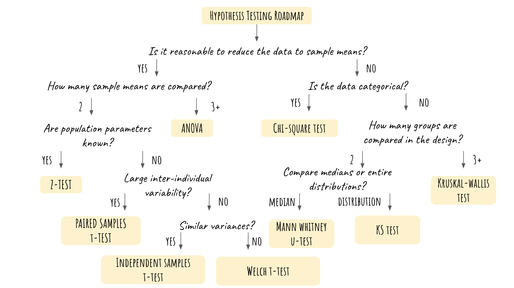

# Hypothesis Testing Guide in R

Zhexin Wang

## Hypothesis Testing in R Cheatsheet Introduction/Explanation
This is a cheatsheet for hypothesis testing in R. However, please note that it only serves as a quick reminder of which test to use and the corresponding code in R, instead of an exhaustive guide on data cleaning and analysis. It is extremely important to check if the data set meet all the assumptions of a test (normality, variance equality, large sample size, etc), even though it's not listed out in detail here.

</br>
The motivation behind this project is the need to grasp the big picture of hypothesis testing and to quickly determine which test to use in different contexts. Even though we've all learned hypothesis testing in detail (either in a data science course or a statistics course), sometimes it's still difficult to take a step back and decide the right statistical test in a systematic while quick approach. Thus the most important part of this cheatsheet is the hypothesis testing roadmap, which provides an easy and structured guide on how to choose a test. The cheatsheet also covers the R code for performing every test mentioned in the roadmap so that users could use it as a brief reference for their own data analysis project.

</br>
I have thoroughly reviewed hypothesis testing by creating this cheatsheet, and learned how to summarize the assumptions of the tests based on the roadmap. Next time, I will include the detailed assumptions of each statistical test instead of just providing the code and the roadmap. 

## Hypothesis Testing Roadmap


## Chi-Square Test in R
</br>
We typically use chi-square test when the dataset has two categorical variables and we want to test if the two variables are related to each other. For example, this chi_sq_data has two variables: treatment and improvement. The patients are either treated or not treated, and the result is either improved or not improved. We want to test if the improvement is dependent on the treatment that the patient received. Thus we conduct a chi-square test as follows:
</br>

1. Importing the data (categorical variables):
```{r}
chi_sq_data <- read.csv("https://goo.gl/j6lRXD")
head(chi_sq_data)
```
</br>
2. Creating a table to check the number of each category:
```{r}
table(chi_sq_data$treatment, chi_sq_data$improvement)
```
</br>
3. Conduct the chi-square test:
```{r}
chisq.test(chi_sq_data$treatment, chi_sq_data$improvement, correct=FALSE)
```
In this case, the p-value = 0.01841, smaller than 0.05. Thus we reject the null hypothesis that the two variables are independent. In other words, we reject the statement that the condition improvement of these patients is not related the treatment.
</br>

## Z-Test in R
</br>
We use z-test when we want to test whether the means from two samples are the same. Notice that we could only use z-test when population standard deviations (or population parameters) are known, and it's actually uncommon in real life examples, where data are messy and the populations parameters are hidden.

</br>
1. Importing the data: (The data we use here is a toy example) suppose we want to check if the mean score of a biology exam from schoolA and schoolB are the same, so we randomly select 30 students from each school and record the score. We assume that the scores from these two schools are normally distributed each with population standard deviation of 10.
```{r}
#Scores from schoolA:
scoreA <- c(82,84,85,89,91,91,92,94,99,99,49,78,89,48,78,90,96,75,87,90,75,76,83,89,86,82,84,82,98,73)

#Score from schoolB:
scoreB <- c(90,91,91,91,95,95,99,99,87,89,47,68,94,89,60,79,80,97,68,84,83,82,86,98,87,72,79,83,85,96)
```
</br>
2. Conduct z-test:
```{r}
library(BSDA)
z.test(x=scoreA, y=scoreB, mu=0, sigma.x=10, sigma.y=10)
```
In this case, the p-value 0.06985 is greater than 0.05. As a result, we reject the hypothesis that the mean scores of school A and school B are the same.
</br>

## Anova in R
</br>
Anova is used to determine whether the means of three or more populations are different. In other words, it is used to compare three or more group and check if they are significantly different from one another. The data should be numerical. Here we will only cover the most basic form: the one-way Anova. 

</br>
1. Importing the data: We will use a built-in R dataset named PlantGrowth. The dataset has two columns: weight and group. There are three groups in general, including one control group and two treatment group. Our goal here is to test whether the population mean of the three groups are the same. 
```{r}
anova_data <- PlantGrowth
head(anova_data)
```
</br>
2. Conducting ANOVA: (Please note that even though we don't include the data cleaning/data visualization process here, a proper data analysis project should address those important steps.)
```{r}
res.aov <- aov(weight ~ group, data = anova_data)
summary(res.aov)
```
Here the p-value is smaller than 0.05, indicating that we should reject the null hypothesis that the groups are the same. The drawback here is that we don't know which pair of groups are different. Thus further analysis such as pairwise t-test or any kind of pairwise comparisons needs to be done in order to analyze the groups in detail.
</br>

## Paired Sample T-test
</br>
Paired sample t-test is used to compare the means between two groups of samples. The hypothesis is that the mean difference between two sets of observations is 0 (or it also could be the mean difference is smaller than 0, greater than 0.) Note that this is different from z-test because population parameters are not known in this case, which makes it much more frequently used than z-test. The data should follow two assumptions: the data are paired and the sample is large enough (n is greater than 30).

</br>
1. Importing the data: Let's use a toy example here. Assume that some students have received tutoring outside of school. Here are grades before and after the tutoring. We want to know if there's significant improvement in their grades after receiving the tutoring. Note that this toy example meets the two assumptions, given that the scores are from the same group of students and the sample size is greater than 30.
```{r}
#Students grades before tutoring
before <- c(80, 75, 90, 68, 79, 49, 86, 58, 79, 76, 54, 89, 50, 68, 59, 80, 75, 90, 68, 79, 49, 86, 58, 79, 76, 54, 89, 50, 68, 59)

#Students grades after tutoring
after <- c(86, 97, 85, 76, 74, 79, 86, 89, 99, 97, 95, 86, 87, 90, 77, 86, 97, 85, 76, 74, 79, 86, 89, 99, 97, 95, 86, 87, 90, 77)

paired_t_data <- data.frame( 
                group = rep(c("before", "after"), each = 15),
                grade = c(before,  after)
                )
head(paired_t_data)
```
</br>
2. Conduct paired sample t-test:
```{r}
res <- t.test(before, after, paired = TRUE)
res
```
The p-value here is much smaller than 0.05, and thus we reject the null hypothesis. It means that the tutoring does help the students to improve their grade. 
</br>

## Independent samples t-test
</br>
The independent samples t-test is used to compare two sample means in order to determine whether the population means are different. There are a few assumptions here: random sampling, continuous variables, independent samples, normality, variance homogeneity, and no outliers.

</br>
1. Importing the data: Let's use the same toy dataset from z-test, assuming that we don't have any information on population parameters in this case. In addition, equal variance and normality is assumed. 
```{r}
scoreA <- c(82,84,85,89,91,91,92,94,99,99,49,78,89,48,78,90,96,75,87,90,75,76,83,89,86,82,84,82,98,73)
scoreB <- c(90,91,91,91,95,95,99,99,87,89,47,68,94,89,60,79,80,97,68,84,83,82,86,98,87,72,79,83,85,96)
```

</br>
2. Conducting independent samples t-test: (in this case both variables are numeric and equal variance is assumed. Independent samples could also be used when one variable is categorical and has exactly two groups)
```{r}
t.test (scoreA, scoreB, var.equal=TRUE)
```
The p-value is much greater than 0.05. Thus we can't reject the null hypothesis that the true difference in means is equal to 0. 
</br>

## Weltch t-test
</br>
Weltch t-test is very similar to independent samples t-test except that equal variance is not assumed.

</br>
1. Importing the data: Let's use the same toy dataset from independent samples t-test, assuming that we don't have any information on population parameters and variance. 
```{r}
scoreA <- c(82,84,85,89,91,91,92,94,99,99,49,78,89,48,78,90,96,75,87,90,75,76,83,89,86,82,84,82,98,73)
scoreB <- c(90,91,91,91,95,95,99,99,87,89,47,68,94,89,60,79,80,97,68,84,83,82,86,98,87,72,79,83,85,96)
```
2. Conducting Weltch t-test: (note that variance equality is not assumed)
```{r}
t.test (scoreA, scoreB, var.equal=FALSE)
```
Since p-value is much greater than 0.05, we failed to reject the null hypothesis that the true difference in means is equal to 0.
</br>

## Mann Whitney U Test
</br>
Mann Whitney U Test is used when we want to compare the median between two independent groups. This test is non-parametric, meaning that the outcome is either not normally distributed or very small. If the dataset is tested to be normal, an independent samples t-test should be used instead.

</br>
1. Importing the data: Let's use a similar toy dataset here, assuming that we don't have any information on population parameters and variance. And the samples are not normally distributed.
```{r}
#costumer ratings before improvment:
ratingA_mann <- c(82,84,85,89,91,91,92,94,99,99,49,78,89,48)

#costumer ratings after improvement:
ratingB_mann <- c(90,91,91,91,95,95,99,99,87,89,47,68,94,89)
```

</br>
2. Conducting Mann Whitney U Test:
```{r}
wilcox.test(ratingA_mann, ratingB_mann)
```
Since the p-value is greater than 0.05, we fail to reject the null that the two populations have the same shape.
</br>

## Kolmogorov-Smirnov Test
</br>
Kolmogorov-Smirnov Test is used when we want to check if the two datasets come from the same distribution. Note that here we are comparing the entire distribution instead of just the medians. 

</br>
1. Generating the data:
```{r}
data1 <- rpois(n=30, lambda=5)
data2 <- rnorm(100)
```

</br>
2. Performing Kolmogorov-Smirnov Test
```{r}
ks.test(data1, data2)
```
The p-value is much smaller than 0.05. Thus we reject the null hypothesis that the two datasets are from the same population.
</br>

## Kruskal-Wallis Test
</br>
Kruskal-Wallis Test is used to compare three or more groups when the data is not categorical. It is a non-parametric alternative to one-way ANOVA test.

</br>
1. Importing data: here let us use the PlantGrowth dataset, and assume it doesn't meet the assumption of ANOVA test. There are three groups in this dataset, including one control group and two treatment groups.
```{r}
kruskal_data <- PlantGrowth
head(kruskal_data)
```
</br>
2. Conducting Kruskal-Wallis Test:
```{r}
kruskal.test(weight ~ group, data = kruskal_data)
```
Since p-value is smaller than 0.05, we reject the null hypothesis that the three groups are not significantly different. However, similar to the case in ANOVA test, we still need to conduct further pair-wise analysis in order to check which two groups are different
</br>

## References:
Special thanks to Professor Pascal Wallisch for his amazing DS Intro course. This cheatsheet is inspired by his lectures\
https://data-flair.training/blogs/chi-square-test-in-r/ \
https://www.statology.org/z-test-in-r/ \
http://www.sthda.com/english/wiki/one-way-anova-test-in-r \
https://rpubs.com/pg2000in/PairedSampletTest \
https://www.statology.org/kolmogorov-smirnov-test-r/ \
http://www.sthda.com/english/wiki/kruskal-wallis-test-in-r \