# Color vision deficiency

Margaret Reed and Yaxin Hu

```{r load-pkgs, include=F}
load.packages("tidyverse")
load.packages("ggokabeito")
library(tidyverse)
library(ggokabeito)
```

Color vision deficiency is typically referred to as color blindness and can be defined as the inability to distinguish certain colors, or any colors at all. Research shows that about 8% of men and 0,5% of women suffer from color blindness deficiency to some extent.

As mentioned in class, color vision deficiency is an important issue to be aware of when creating data visualizations. While red-green confusion is the most well known there are several types, all of which should be considered when creating accessible visualizations.

Problems faced by color blind people when it comes to data visualization:

*Not being able to recognize series or categories:
The biggest problem occurs when people suffering from CVD has to distinguish between categories. Certain colors that look totally different for healthy people may look almost identical for color blind people.

*Not being able to recognize the key message at a glance:
Another problem might occur is that color blind people may not be able to recognize key message at a glance. For example you might color code your graph in the way that the increase is colored in green and decrease is colored in red. But color blind people wouldn't notice that.

So it is important to design color vision deficiency friendly graph when doing visualization.


### Types of color vision deficiencies:

#### Red-green color blindness

The most common type of color blindness makes it hard to tell the difference between red and green.

There are 4 types of red-green color blindness:

**Deuteranomaly** is the most common type of red-green color blindness. It makes green look more red. This type is mild and doesn't usually get in the way of normal activities.

**Protanomaly**- makes red look more green and less bright. This type is mild and usually doesn't get in the way of normal activities.

**Protanopia** and **deuteranopia** both make you unable to tell the difference between red and green at all.

#### Blue-yellow color blindness

This less-common type of color blindness makes it hard to tell the difference between blue and green, and between yellow and red.

There are 2 types of blue-yellow color blindness:

**Tritanomaly**- makes it hard to tell the difference between blue and green, and between yellow and red.

**Tritanopia**- makes you unable to tell the difference between blue and green, purple and red, and yellow and pink. It also makes colors look less bright.

#### Complete color blindness

If you have complete color blindness, you can't see colors at all. This is also called **monochromacy**, and it's quite uncommon. Depending on the type, you may also have trouble seeing clearly and you may be more sensitive to light.

Source: <https://www.nei.nih.gov/learn-about-eye-health/eye-conditions-and-diseases/color-blindness/types-color-blindness>

### Test your plots

While not an exact science, there are some great tools to test how your visualizations may look to someone with these conditions. The one I like the most is Sim Daltonism. ([Download here](https://apps.apple.com/us/app/sim-daltonism/id693112260?mt=12))

However, this application only works on Macs so if you have a windows or linux machine, I would recommend the program that was suggested in class.

Here is an example of what the standard ggplot color palette looks like with different color vision deficiencies.

#### Original:

```{r}
iris %>%
  ggplot(
    aes(x = Sepal.Length, y = Petal.Width, color = Species)
  ) +
  geom_point()
```


Here is how this might plot look like with the above conditions:

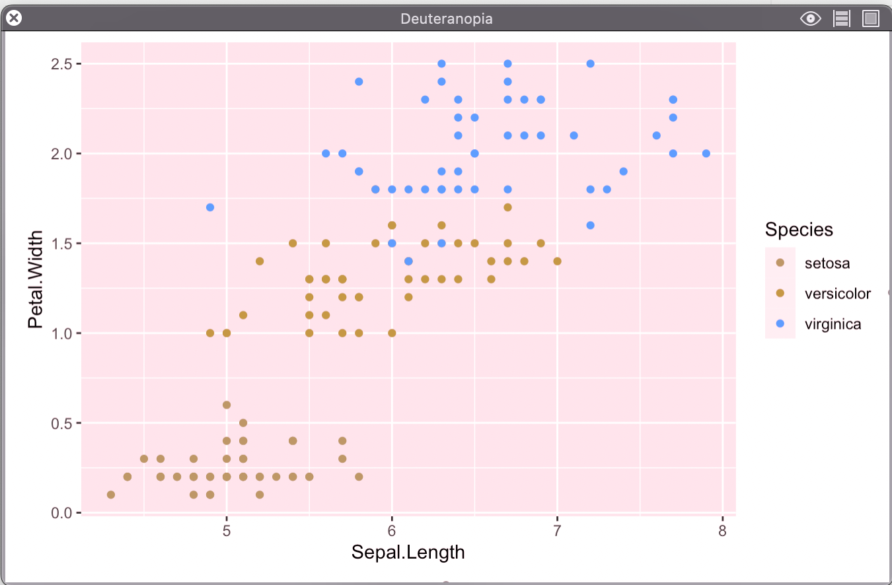{width="290"} 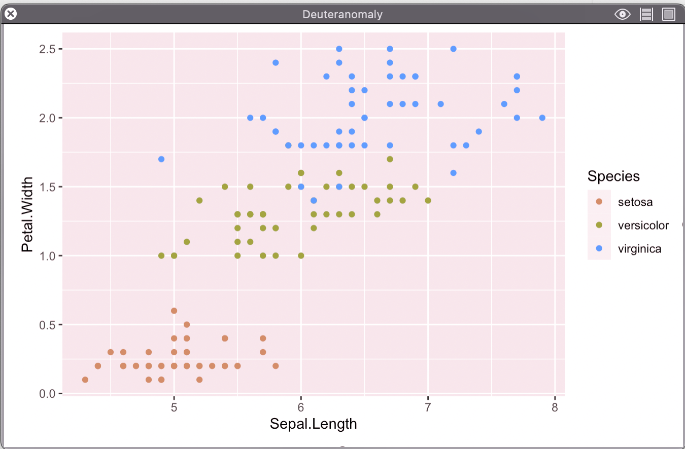{width="290"} 
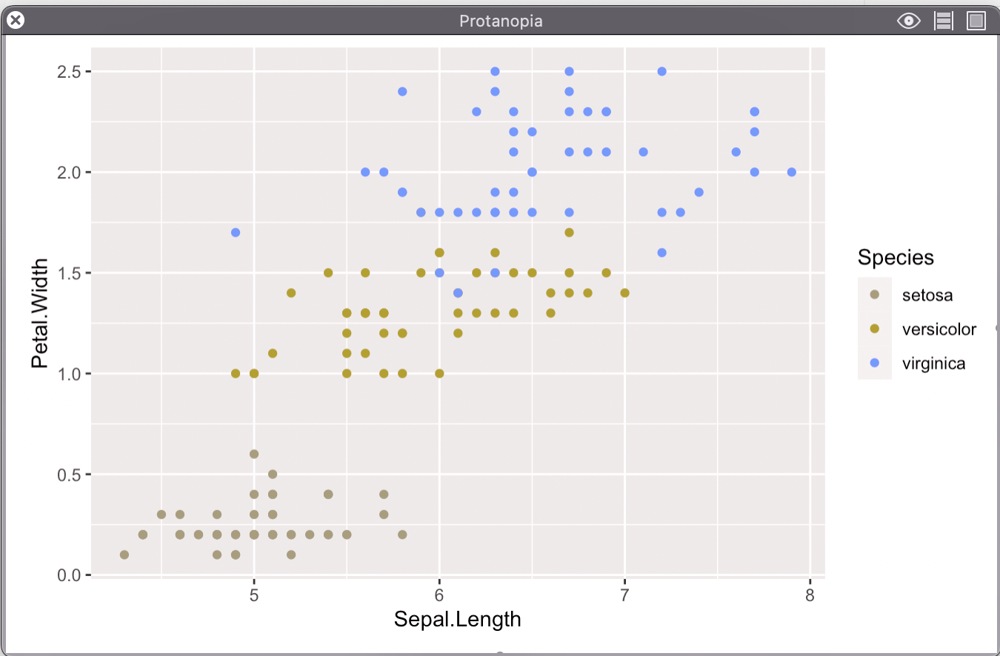{width="290"} 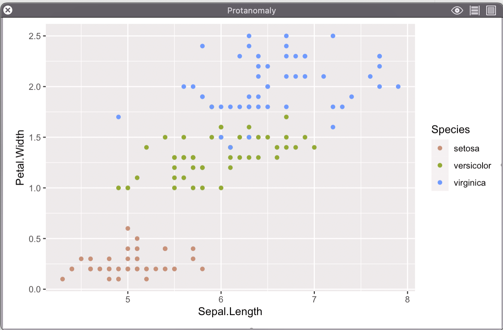{width="290"} 
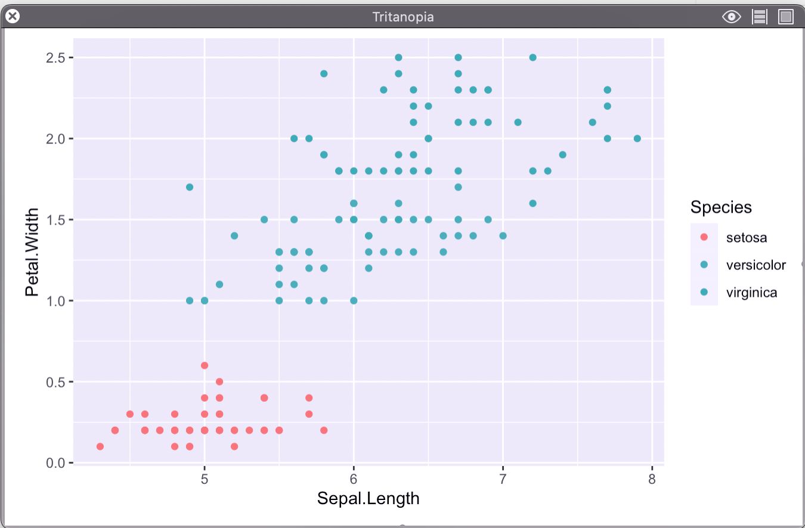{width="290"} 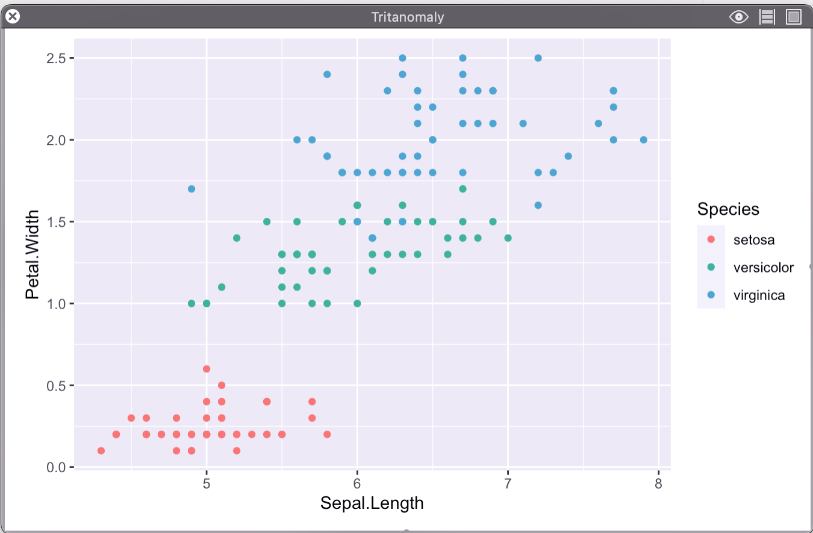{width="290"}
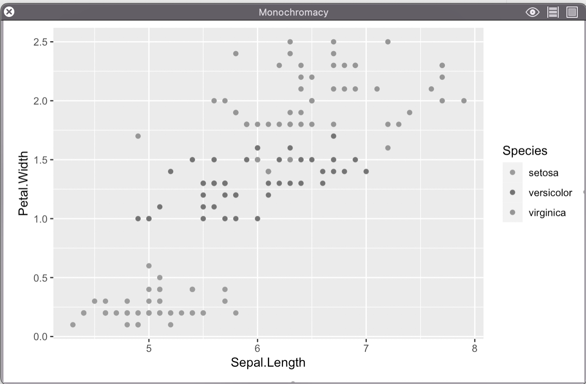{width="290"} {width="290"}

**Ways to improve without changing color:**

Increase Contrast:

```{r}
iris %>%
  ggplot(
    aes(x = Sepal.Length, y = Petal.Width, color = Species)
  ) +
  geom_point() +
  theme_minimal()
```

Double Encoding:

```{r}
iris %>%
  ggplot(
    aes(x = Sepal.Length, y = Petal.Width, color = Species, shape = Species)
  ) +
  geom_point() +
  theme_minimal()
```

**A Better Palette:**

I really like the Okabe-Ito pallete designed by Masataka Okabe and Kei Ito

(learn more read [here](https://jfly.uni-koeln.de/color/): )

Here is a [good visual guide](https://mikemol.github.io/technique/colorblind/2018/02/11/color-safe-palette.html).

To easily use this palette in R, I like the `ggokabeito` package, which can be downloaded from CRAN.

Example with new color palette:

```{r okabeito-plot}
iris %>%
  ggplot(
    aes(x = Sepal.Length, y = Petal.Width, color = Species)
  ) +
  geom_point() +
  scale_color_okabe_ito(order = c(3,7,9)) +
  theme_minimal()
```


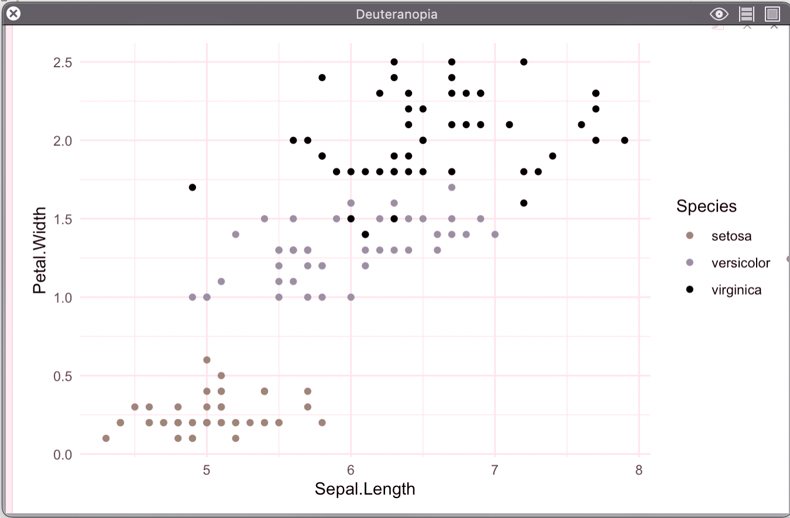{width="290"} 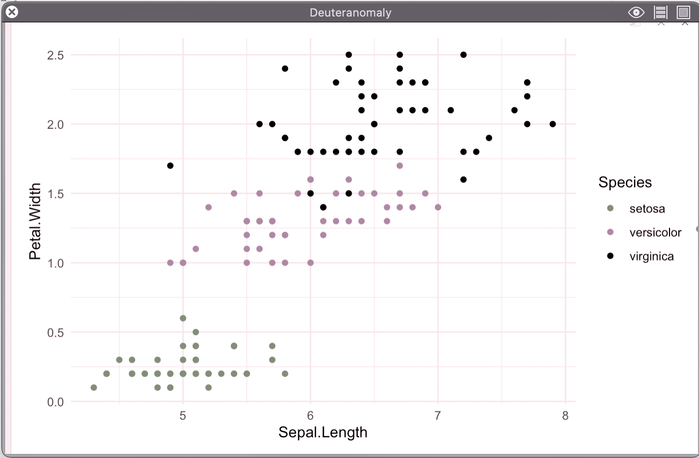{width="290"} 
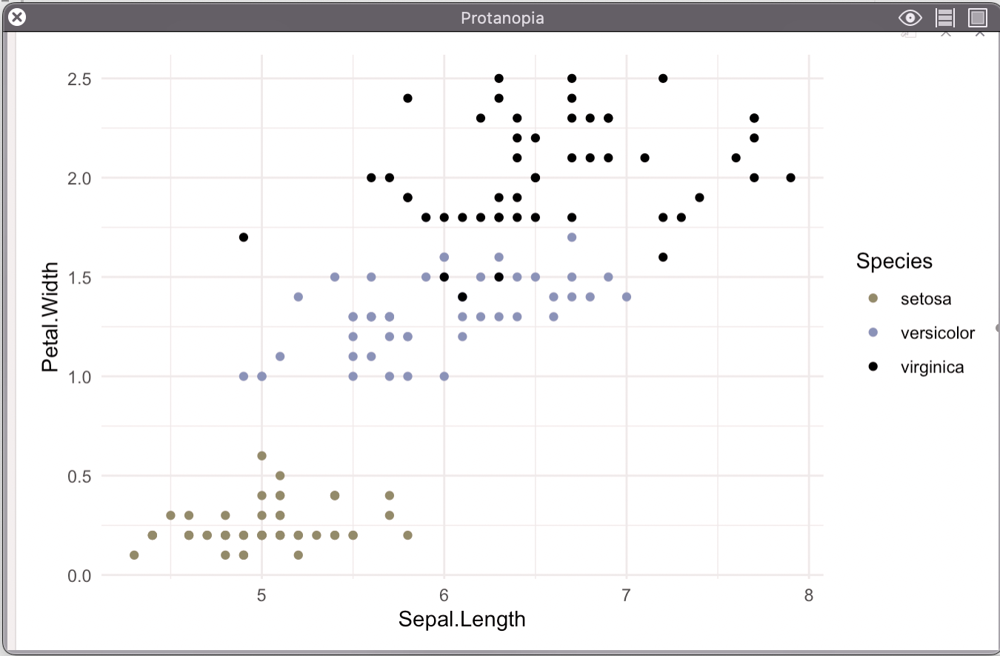{width="290"} {width="290"} 
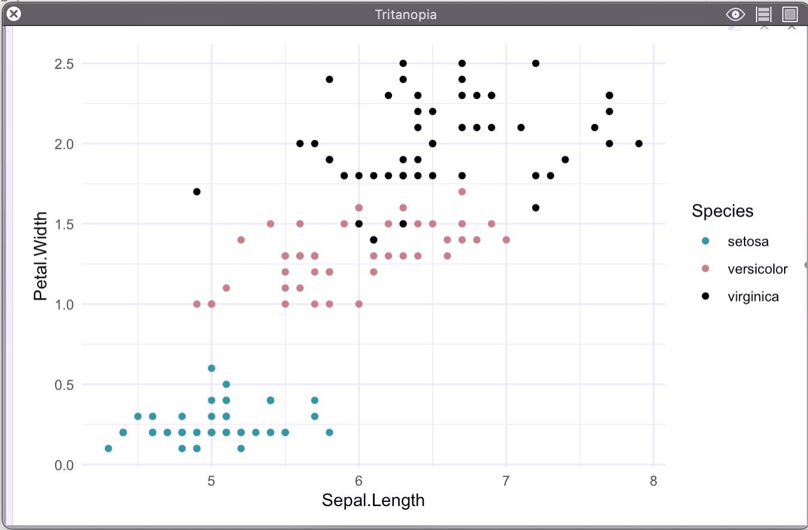{width="290"} 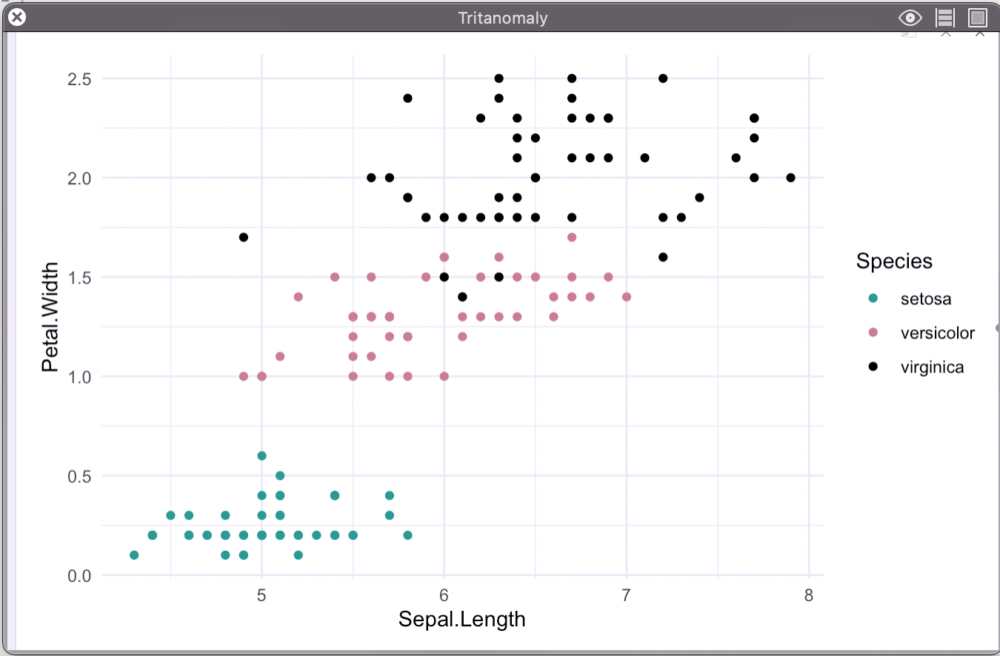{width="290"}
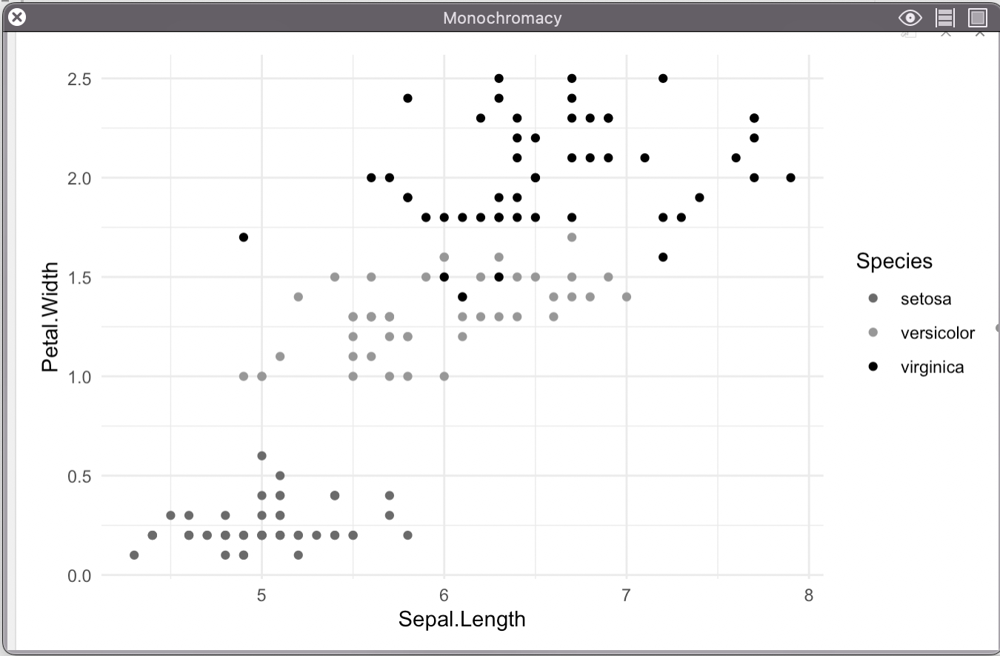{width="290"} 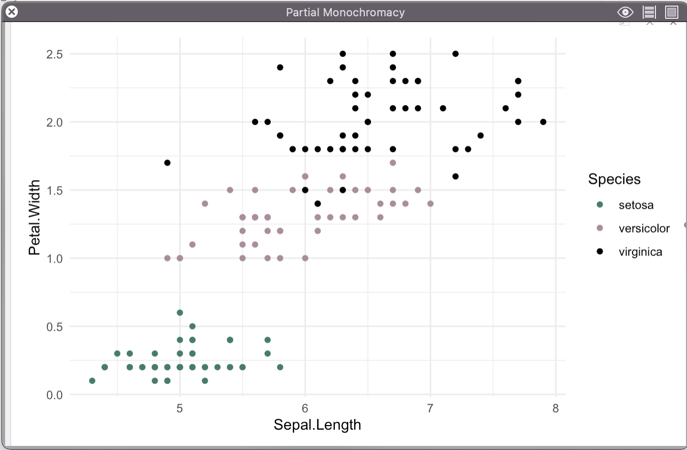{width="290"}


### Other considerations

While it is very important to make sure that data science and visualizations are accessible to as many people as possible, these considerations for color extend further than those with color vision deficiencies. Often times the medium in which we present our visualizations can considerably impact how the color distinctions come across. Not every visualization is viewed on a large projector, some are dispersed for individual viewing, while others may even be printed in black and white. Therefore is it very important to consider other skills such as double encoding, using shapes and textures, using high contrast colors when creating visualizations.


