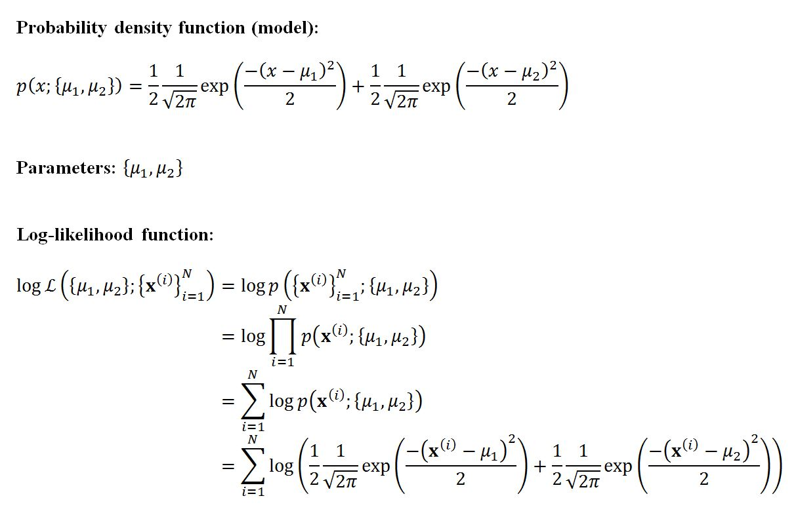
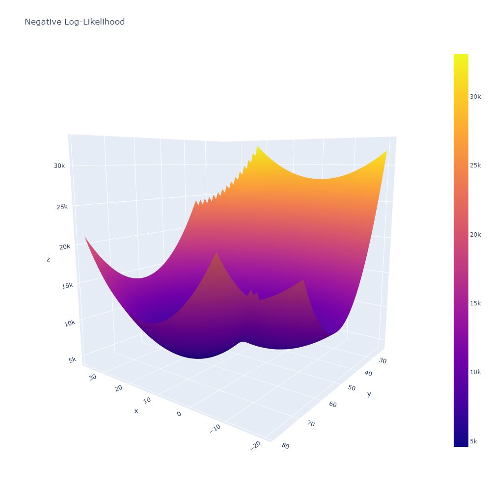
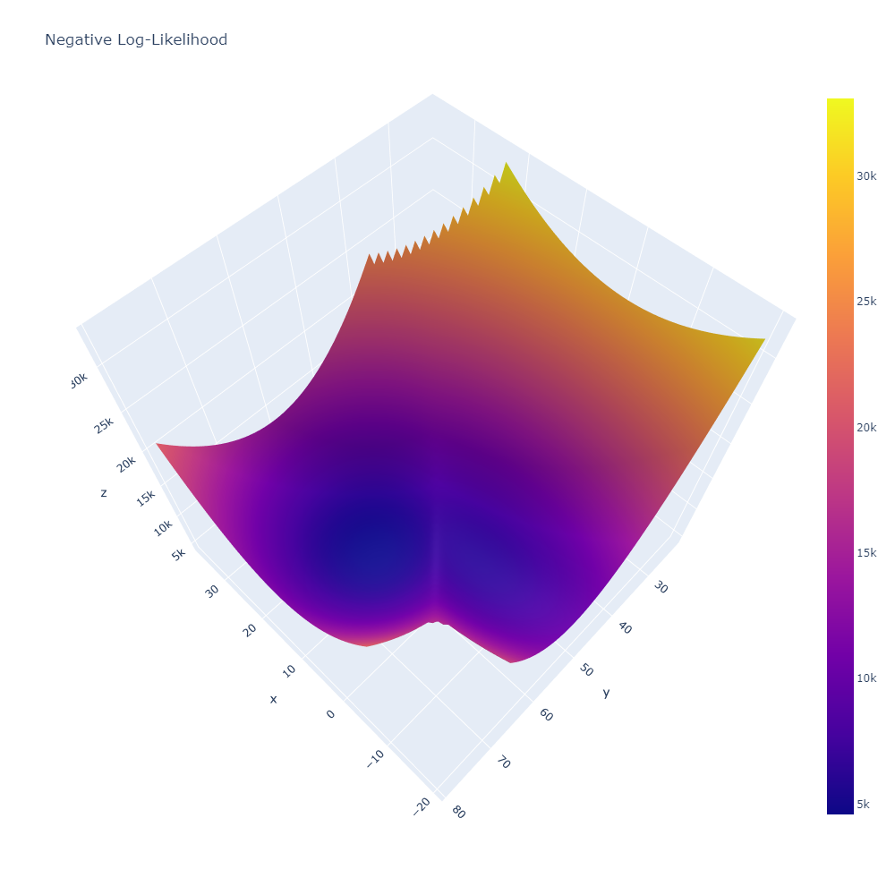

# Tutorial on Plotly Python 3D Surface and it's Use in Gradient Descent

Yuxiao Liu, Fan Wu

### Description

In this tutorial, we will show the application of 3D surface plot ([Plotly 3D Surface Plots](https://plotly.com/python/3d-surface-plots/) tool) in gradient descent.

In class, we covered techniques that shows continuous data in 3 dimensions, e.g. heatmap, contour. In those techniques, however, the third dimension is frequency rather than a variable per se. 3D surface plot is like a dimensional expansion to line chart - the most common and direct way to depict the relationship between continuous variables.

In gradient descent, the objective is to minimize the objective function (negative log-likelihood function in the maximum likelihood setting). When the number of parameters is 2, it becomes a perfect use case to visualize via the 3D surface plot, because there are two independent variables (the parameters) and one dependent variable (the negative log-likelihood).

One of the common issues with gradient decent is that: in each iteration, it always moves in the direction with the locally steepest decrease in the objective function, and the process may end up in a local minimum if there is one. A 3D surface plot can help us avoid this, and it can also provide insight in the choice of initial parameter values.

Source: https://plotly.com/python/3d-surface-plots/

### Gradient Descent Example

We here provide an example of a use case:

* In this example, we try to fit a probability distribution to a 1-dimensional data set, via maximum likelihood method.
* The probability distribution is a mix of two standard normal distributions whose means are unknown.
* Gradient descent is the intended method to minimize the negative log-likelihood function.

```{r, echo=FALSE}

```

Any gradient descent problem with 2 parameters can be fit into the Python template below. The only thing that need to be updated is the negative log-likelihood function. 

```{r, include=FALSE}
# this prevents package loading message from appearing in the rendered version of your problem set
knitr::opts_chunk$set(warning = FALSE, message = FALSE)
```

```{python, eval=FALSE}
import numpy as np
import plotly.graph_objects as go

# Negative log-likelihood function
def neg_log_likelihood_func(theta, data):
    N = data.shape[0]
    mu1, mu2 = theta
    if mu1 > mu2:
        return np.nan
    loglikelihood = 0
    for x in data:
        density1 = np.exp(- (x - mu1) ** 2 / 2) / (2 * np.pi) ** 0.5
        density2 = np.exp(- (x - mu2) ** 2 / 2) / (2 * np.pi) ** 0.5
        loglikelihood = loglikelihood + np.log(0.5 * density1 + 0.5 * density2)
    return - loglikelihood
  
# Generate a random data set (which does not exactly follow the assumed model)
data1 = np.random.normal(loc = 0, scale = 0.5, size = 20)
data2 = np.random.normal(loc = 30, scale = 0.5, size = 20)
data3 = np.random.normal(loc = 60, scale = 0.5, size = 40)
data = np.concatenate([data1, data2, data3])

# (X, Y) represents grid for (mu1, mu2), Z represents log-likelihood values
x = np.arange(-20, 80, 1)
y = np.arange(-20, 80, 1)
X, Y = np.meshgrid(x, y)
Z = np.array([np.array([neg_log_likelihood_func((X_elem, Y_elem), data) for (X_elem, Y_elem) in zip(X_row, Y_row)])
       for (X_row, Y_row) in zip(X, Y)])

# Plot using plotly
# The plotly functions cannot run correctly in Rmd, thus here we comment them out and attach the plots (generated in Python environment)
# fig = go.Figure(data=[go.Surface(z = Z, x = X, y = Y)])
# fig.update_layout(title='Log-Likelihood', autosize=False,
#                   width=1000, height=1000)
# fig.show()
```

### 3D Surface Plots (negative log-likelihood)

From the 3D surface plot, we clearly see that there is a local minimum (of the negative log-likelihood function) besides the global minimum. The local minimum is located near $\mu_1 = 0, \mu_2 = 50$ (where $\mu_1$ is labeled as $x$ and $\mu_2$ is labeled as $y$). Therefore, before running gradient descent algorithm, we gain the insight that we should not choose initial parameter values close to the local minimum.

```{r, echo=FALSE}


```
