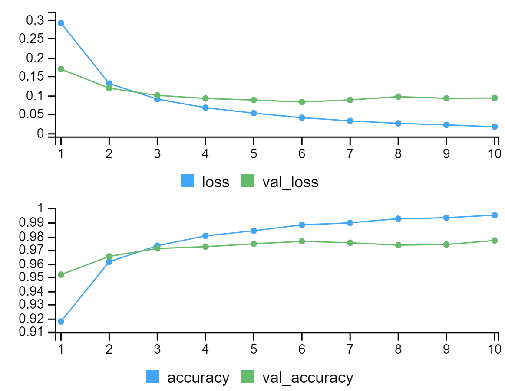

# Introduction to neural network in R

Zhihang Xia

```{r, include=FALSE}
knitr::opts_chunk$set(echo = TRUE)
```

```{r, eval=FALSE}
library(tensorflow)
library(keras)
```

## Motivation

In modern data-driven society, it is getting much easier and easier for us to obtain massive amounts of data, followed by the rapid development and wide application of machine learning. Of course, machine learning is one of the best methods when faced with huge data, but it is undeniable that with the development of technology, some machine learning models, especially the basic models, such as SVM and decision tree have been used less and less in the industry. Since the techniques of deep learning appears, neural network models have been more popular. Different from machine learning, which highly relies on algorithms, deep learning uses neural networks modeled on the human brain. Therefore, deep learning has some advantages over machine learning. For example, neural network works well with unstructured data, which means it has better performance especially when faced with messy data, which is more likely for us to see in the real world. Here, I would like to introduce the basic deep learning here using R, to get your familiar with basic neural network training from end to end.

## Basic idea of Neural Network


The basic idea of Neural Network is to simulate the neural network of human brain, which consists of an input layer, followed by several hidden layer and a output layer. Each unit of the current layer is a linear combination of the units from previous layer. The linear result can also be transformed by some activation functions, such as relu and softmax.

## Example

### Loading and processing data

We are going to use the mnist dataset in keras, which contains images of written digits of 0-9 and corresponding labels.

```{r, eval = FALSE}
c(c(X_train, y_train), c(X_test, y_test)) %<-% keras::dataset_mnist()
```

```{r, eval = FALSE}
dim(X_train)
dim(y_train)
dim(X_test)
dim(y_test)
```
By printing out the dimensions, we can see that there are 60000 training data and 10000 test data in total. Also, each image is represented by 28x28 pixel values, and each label is the corresponding digit.

```{r, eval=FALSE}
test_img <- image(X_train[50,1:28,1:28])
y_train[50]
```
we are trying to check if we load the data correctly. Here, we can see that the 50th image and its related label is "3".

Then we need to rescale the image, making the pixel value is from 0 to 1.

```{r, eval=FALSE}
X_train <- X_train / 255
X_test <-  X_test / 255
y_train <- to_categorical(y_train, num_classes = 10)
y_test <- to_categorical(y_test, num_classes = 10)
```


### Build and compile our model

Here, we are trying to sequentially build up the neural network layers in this way:

1. a layer that flattens the image input from the shape (28,28) to the one-dimensional shape (28*28)

2. a fully-connected layer with hidden unit size 128 and followed by relu activation function

3. a output layer with unit size 10

```{r, eval=FALSE}
model <- keras_model_sequential() %>%
  layer_flatten(input_shape = c(28,28)) %>%
  layer_dense(128, activation = "relu") %>%
  layer_dense(10)
```

Then we compile our model with sgd optimizer and cattegorical cross entropy loss function.

Optimizer specifies a way to apply gradient descent update of model parameters, and loss function is the objective function to minimize over.

```{r, eval=FALSE}
opt <- optimizer_sgd()
loss_fn <- loss_categorical_crossentropy(from_logits = TRUE)
```

```{r, eval=FALSE}
model %>% compile(
  optimizer = opt,
  loss = loss_fn,
  metrics = c("accuracy")
)
```

```{r, eval=FALSE}
summary(model)
```


### Train and test model

Now We train our compiled model with 10 ephocs and 32 batch size. Also, we use 20% of the training set as our validation set.

```{r, eval=FALSE}
history <- model %>% fit(X_train, y_train, ephocs=10, batch_size=32, validation_split=0.2)
history
```
Here is the training/validation loss and accuracy during the training process. R will automatically plot the output.


Finally we use the test set to evaluate our model.

```{r, eval=FALSE}
model %>% evaluate(X_test, y_test)
```

### Change optimizer

Now we try to use adam optimizer instead of sgd.

```{r, eval=FALSE}
model1 <- keras_model_sequential() %>%
  layer_flatten(input_shape = c(28,28)) %>%
  layer_dense(128, activation = "relu") %>%
  layer_dense(10)
```

```{r, eval=FALSE}
opt1 <- optimizer_adam()
```

```{r, eval=FALSE}
model1 %>% compile(
  optimizer = opt1,
  loss = loss_fn,
  metrics = c("accuracy")
)
```

```{r, eval=FALSE}
history1 <- model1 %>% fit(X_train, y_train, ephocs=10, batch_size=32, validation_split=0.2)
history1
```

```{r, eval=FALSE}
model1 %>% evaluate(X_test, y_test)
```

We see the model with adam optimizer has a highter test accuracy than the one with sgd optimizer.

## Reference

[https://www.datacamp.com/tutorial/keras-r-deep-learning](https://www.datacamp.com/tutorial/keras-r-deep-learning)

[https://tensorflow.rstudio.com/tutorials/quickstart/beginner](https://tensorflow.rstudio.com/tutorials/quickstart/beginner)
