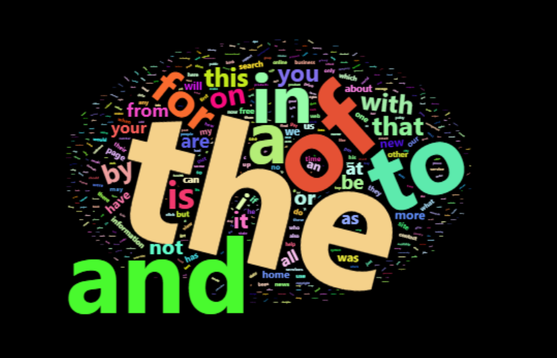
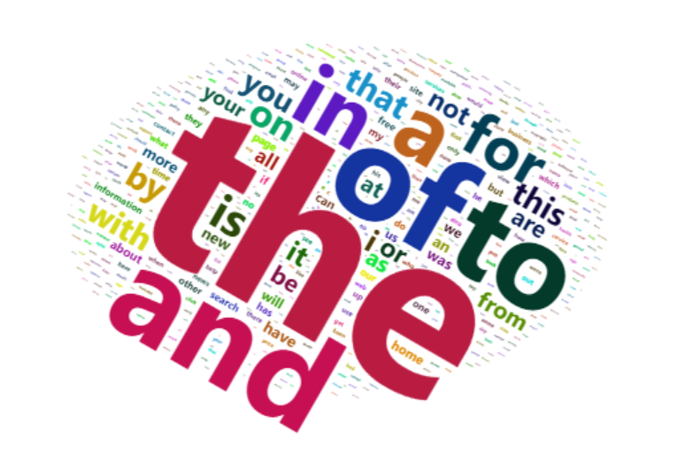
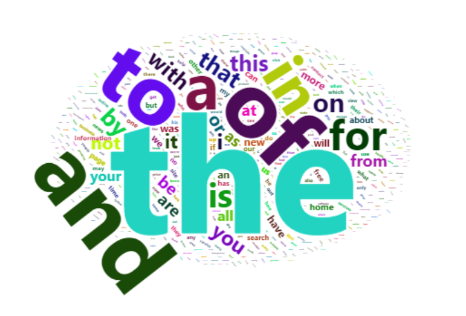
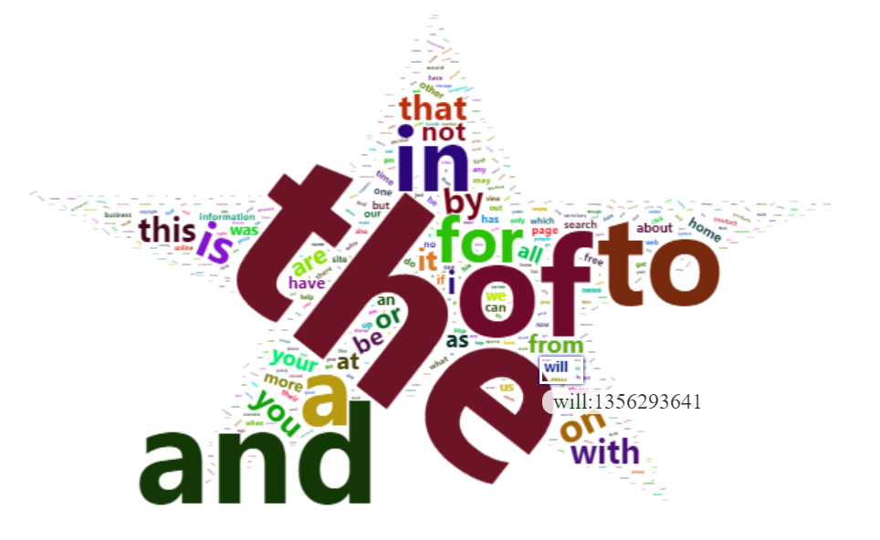
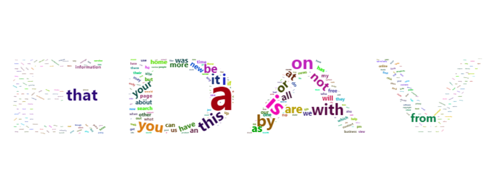
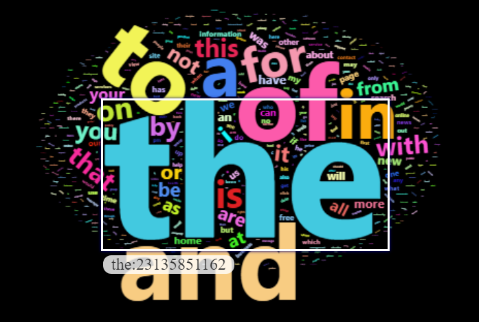
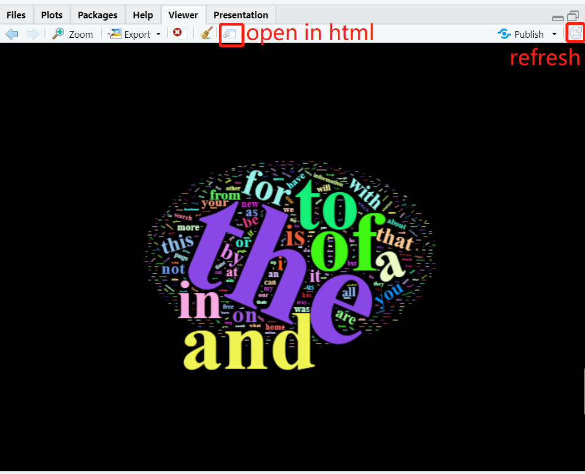

# Tutorial for wordcloud2 package  
  
Ruoyu Chen and Yitong Zhou  
  
```{r, warning=FALSE, message=FALSE}
library(devtools)
#devtools::install_github("lchiffon/wordcloud2", force = TRUE)
library(wordcloud2) # must be installed from source
library(tidyverse)
```
 
## Motivation  
There are many useful packages in “R” to visualize data, and we introduce “wordcloud2” to help users visually represent data related to frequency. Word frequency statistics method is very popular in today’s research and life, especially the text mining method. “Wordcloud2” helps to visualize the result of word frequency statistics. A word cloud shows off trends, which is a visual representation that supplements a section of text to help users better present an idea. “wordcloud2” shows the popularity of words by making the words with the highest frequency larger or bolder. Users could also self-define the color and shape of word clouds.   
  
It addresses users’ need to visualize data with different frequencies. With the visualized pictures, readers could directly sense the data’s relative frequency.   

## "wordcloud2" Fuction:

```{r, eval = FALSE}
wordcloud2(data,size = 1, minSize = 0, gridSize =  0,
    fontFamily = NULL, fontWeight = 'normal',
    color = 'random-dark', backgroundColor = "white",
    minRotation = -pi/4, maxRotation = pi/4, rotateRatio = 0.4,
    shape = 'circle', ellipticity = 0.65, widgetsize = NULL)
```
  
- `data`: A data frame including word and freq in each column
- `size`: Font size, default is 1. The larger size means the bigger word.
- `fontFamily`: Font to use, e.g. Times New Roman, Calibri Light,...
- `fontWeight`: Font weight to use, e.g. normal, bold or 600
- `color`: color of the text, keyword "random-dark" and "random-light" can be used. color vector is also supported in this param
- `minSize`: A character string of the subtitle
- `backgroundColor`: Color of the background.
- `gridSize`: Size of the grid in pixels for marking the availability of the canvas the larger the grid size, the bigger the gap between words.
- `minRotation`: If the word should rotate, the minimum rotation (in rad) the text should rotate.
- `maxRotation`: If the word should rotate, the maximum rotation (in rad) the text should rotate. Set the two value equal to keep all text in one angle.
- `rotateRatio`: Probability for the word to rotate. Set the number to 1 to always rotate.
- `shape`:The shape of the “cloud” to draw. Can be a keyword present. Available presents are "circle" (default), "cardioid" (apple or heart shape curve, the most known polar equation), "diamond" (alias of square), "triangle-forward", "triangle", "pentagon", and "star".
- `ellipticity`: degree of “flatness” of the shape wordcloud2.js should draw.
- `figPath`: A fig used for the wordcloud.
- `widgetsize`: size of the widgets

## Function application

### Data scource
We use a dataset, which contains the most commonly used single words on the English language web, as derived from the Google Web Trillion Word Corpus, to show how we could apply "wordcloud2" package to draw multiple and useful world clouds. Since the dataset has 333333 rows, we will only use the top 500 most commonly used single words.  
```{r, message=FALSE,warning=FALSE}
unigram_freq <- read_csv("resources/wordcloud2_tutorial/unigram_freq.csv",show_col_types = FALSE)
unigram_freq <- unigram_freq[0:500,]
```

### Color and backgroundcolor
User could define the color and background that they like. The output of wordcloud2 should be a HTML widget. However, since it is possible to have knitting issues, We insert the word cloud.   
```{r,fig.align='center',eval=FALSE}
wordcloud2(unigram_freq, color = "random-light", backgroundColor = "black")
```
<center>
{width=60%}
</center>  
  
### Rotation  
We could set "minRotation", "maxRotation", and "rotateRatio" to rotate the texts in the cloud. "rotateRatio" of all the texts will be rotated within the scope (minRotation, maxRotation). The output of wordcloud2 should be a HTML widget. However, since it is possible to have knitting issues, We insert the word cloud.    
```{r,fig.align='center'}
wordcloud2(unigram_freq, size = 1, minRotation = -pi/6, maxRotation = -pi/6,
  rotateRatio = 1)
```
<center>
{width=60%}
</center>  
  
If rotateRatio = 0.5, then only half of the words will be rotated. If minRotation $\neq$ maxRotation, words will be rotated between minRotation and maxRotation.  The output of wordcloud2 should be a HTML widget. However, since it is possible to have knitting issues, We insert the word cloud.     
```{r,fig.align='center'}
wordcloud2(unigram_freq, size = 1, minRotation = -pi/3, maxRotation = -pi/6,
  rotateRatio = 0.5)
```
<center>
{width=60%}
</center>  
  
### Specific shape inside the package  
You can chose the shape of the cloud produced by setting a parameter for "shape", "wordcloud2" provide mutiple shapes for users, you can chose the one you like, such as "star", "circle", "cardioid", "diamond", "triangle-forward", "triangle", "pentagon." The output of wordcloud2 should be a HTML widget. However, since it is possible to have knitting issues, We insert the word cloud.    
```{r,fig.align='center'}
wordcloud2(unigram_freq, size = 1,shape = 'star')
```
<center>
{width=60%}
</center>  
  
### Self-defined shape
You could self-define what the picture looks like by setting the parameter "figPath". Upload your self-defined picture by figpath, and then apply "worldclouds2" packages. In this example, we use this sun.jpg as the mask. Usually, the image is a black and white image. Since Rmarkdown has some problems when knitting the wordcloud, in order to show the result of the wordcloud, we download the wordcloud and insert it as an image.   
```{r,eval=FALSE}
wordcloud2(unigram_freq, figPath = "sun.jpg", size = 1.9,color = "red")
```

```{r, echo=FALSE,out.width="50%", fig.cap = "wordcloud with self-defined shape",out.height="30%",fig.show='hold',fig.align='center'}
knitr::include_graphics(c("resources/wordcloud2_tutorial/sun.jpg","resources/wordcloud2_tutorial/wordcloud_sun.png"))
```  
  
## "letterCloud" function  
Instead of using a specific shape, we can create wordcloud by customizing the shape of a word.  
```{r, eval = FALSE, warning=FALSE, message=FALSE}
letterCloud(data, word, wordSize = 0, letterFont = NULL,...)
```
- `data`: A data frame including word and freq in each column
- `word`: A word to create shape for wordcloud
- `wordSize`: Parameter of the size of the word
- `letterFont`: Letter font
- ...: Other parameters for wordcloud
  
## Function Application  
Using the same data `unigram_freq`, and let "EDAV" as the word. Since Rmarkdown has some problems when knitting the wordcloud, in order to show the result of the wordcloud, we download the wordcloud and insert it as an image.    
```{r,eval=FALSE}
letterCloud(unigram_freq, word = "EDAV",wordSize = 1, size = 3)
```
<center>
{width=70%}  
</center>  
  
## Some Tips for Using Word Clouds  
- When using the letterCloud() function, it is important to make sure the dataset has enough words. The more letters we include in the shape of word, the more words we need.  
- fontFamily in wordcloud2() include almost all the fonts we have in word document such as Times New Roman, Calibri Light,... However, choosing the most appropriate font for the project is more important.  
- In the self-defined shape and letterCloud() function, size and wordSize need to be considered to return a desired wordcloud.  
- If the range of words' count is too large, doing som data preprocessing might be helpful to create a better word cloud such as removing words with the least frequency.
- As mentioned above, we chose to insert the word cloud in order to avoid possible knitting issues. However, a word cloud in HTML is interactive. When we move the mouse on the word, it shows the frequency of this word:  
<center>
{width=60%} 
</center>  
    
## Common Problems  
- Having issue after downloading from CRAN?   
`It is recommended to use the github sources as mentioned in the beginning of this tutorial.`  
- Unable to show the word cloud?  
`There is no other method to solve this problem otherwise refreshing the window you could try to either refresh it using the button on the top right corner or open it as in html in a new window. Same for .rmd file.`    
<center>
{width=60%}  
</center>   
- How to knit the word cloud into a pdf?    
`wordcloud2 returns HTML widgets. You could either save the image and insert it manually or using package webshot`  
- More Problem?  
`This Github page by the packagre creator might be helpful:`
[wordcloud2 issues](https://github.com/Lchiffon/wordcloud2/issues)  
  
## Evaluation  
This project aims to summarize the main functions of the "wordcloud2" package and its advantages and disadvantages. In the process, we learned how to use a word cloud to show the frequency of words, which is a unique feature of the word cloud. This is a strong visualization function because word cloud has more visual impact than a bar chart and other visualization techniques. The larger size of the more frequently used words can catch the audience’s attention immediately. Also, users can customize the color of the word and background to fit the application. Moreover, since functions in wordcloud2 returns an HTML widget, placing the mouse over the word can see the frequency of this word, which can fit in an interactive web visualization.   
   
There are also some disadvantages of the wordcloud2 package. Although the basic wordcloud2() function can return a stable HTML widget, customizing our own shape either by using an image or letters would lead to an empty result. The way to solve this problem is to refresh the window. This will cause a problem when knitting a pdf or HTML like this tutorial. The method we chose is to save the word cloud as an image and insert it into the HTML. However, this will lose the function of the word cloud in user interaction.    
  
If we were to do it again, we would change a different dataset. Our current dataset is about the most frequently used English words which are very interesting. However, word clouds are more useful for analyzing audiences’ ideas such as the public opinion of a certain product. Also, wordcloud2 isn’t the only package that can generate word clouds. We could add some comparisons between different word cloud packages.   
  
## Citation  
[CRAN wordcloud2](https://cran.r-project.org/web/packages/wordcloud2/vignettes/wordcloud.html)  
[rdocumentation letterCloud](https://www.rdocumentation.org/packages/wordcloud2/versions/0.2.1/topics/letterCloud)

